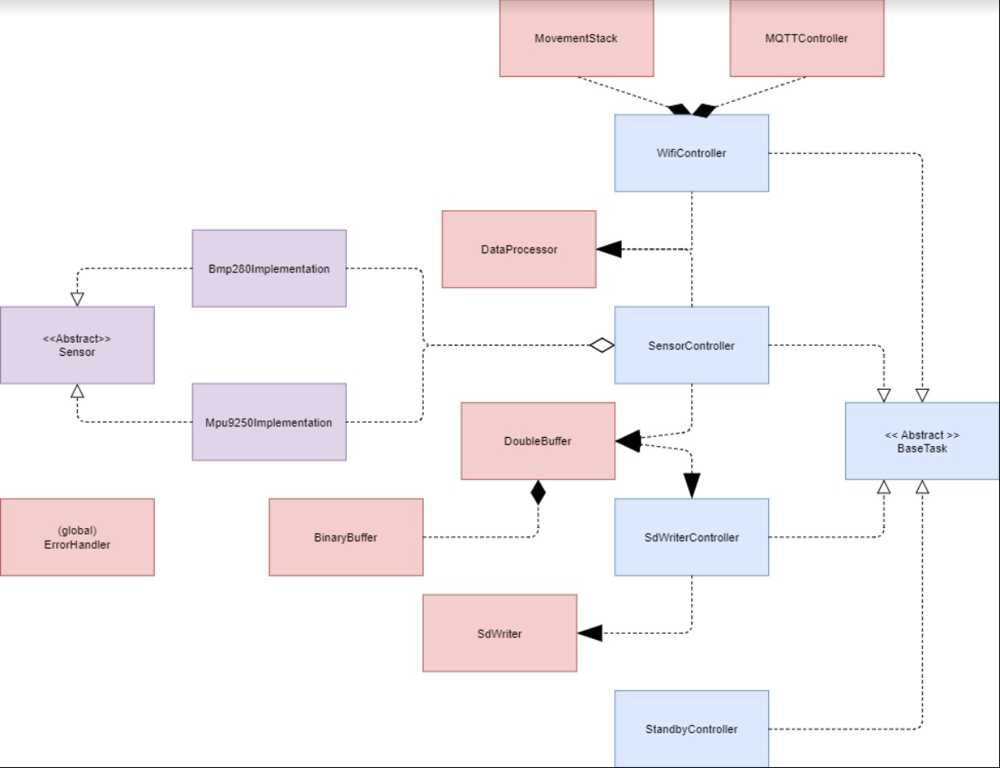
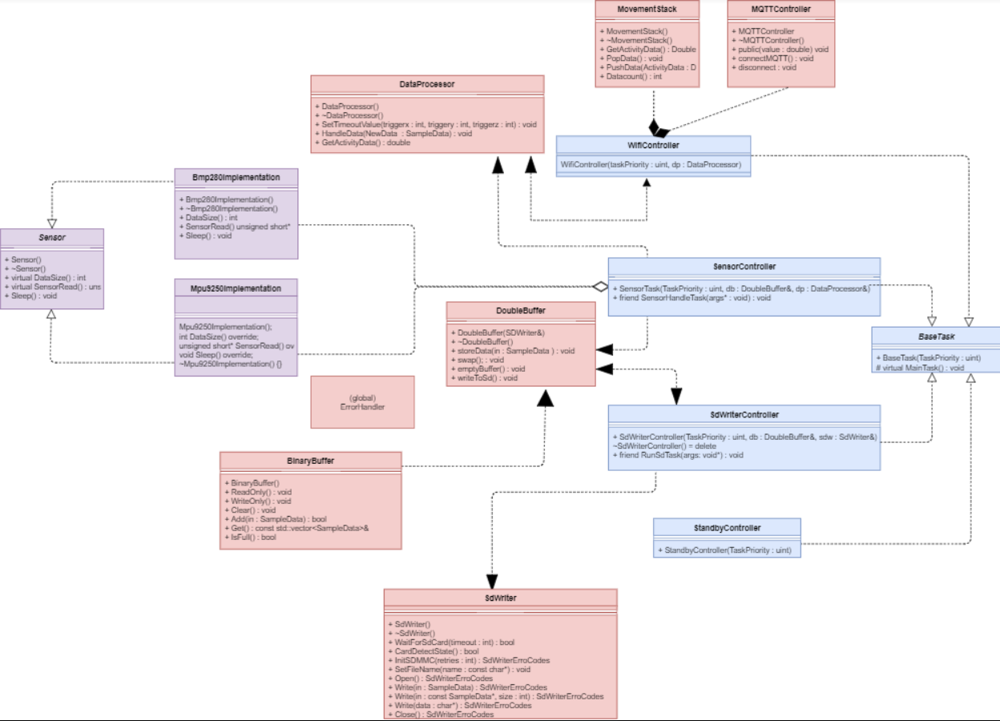
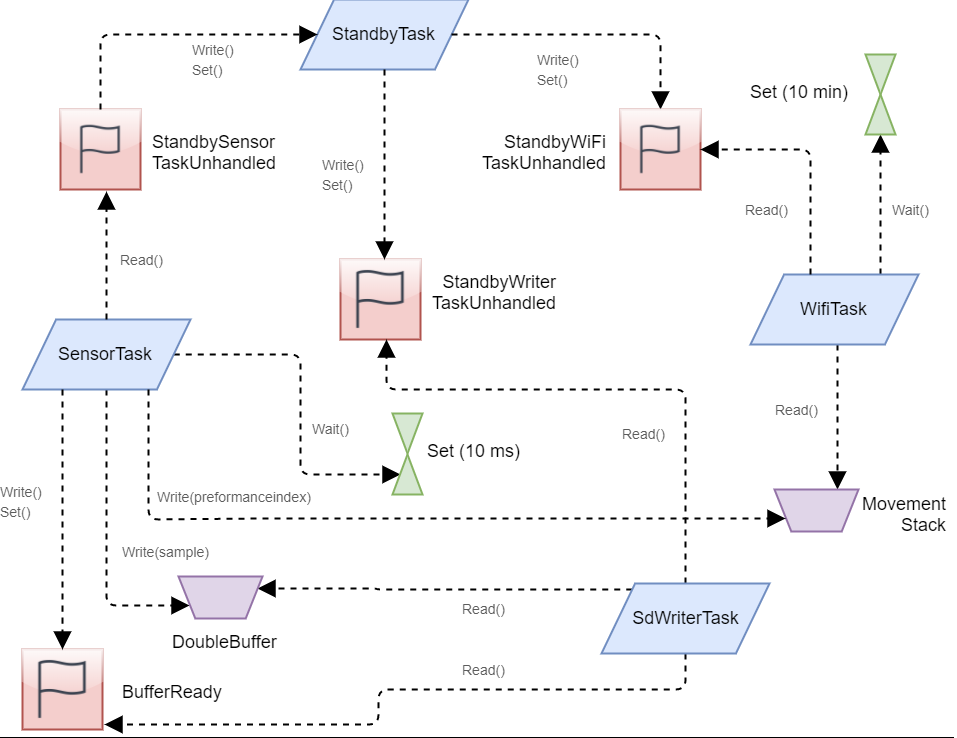
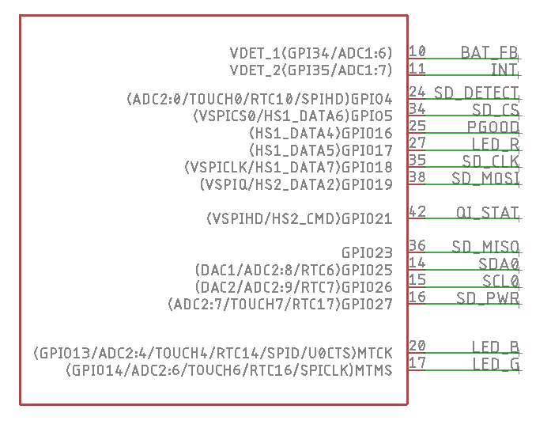
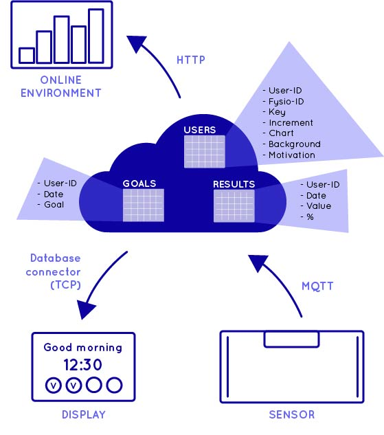

# ACTS-Sensor
This repository contains code for the ACTS sensor module.
The use of this repository is limited to the ACTS (sensor) project.

## Brief explanation about project
This project is meant to collect detailed data from cva patients. This can then be parsed by complex algorithms and scientists to study movement in these patients. The sensor module also creates a simple performance index that is sent to an aws backend server. These performance indexes are then parsed to provide feedback to therapists and cva patients on which they can improve.

### Technical description
This project can be run on a esp32 with ESP-iDF (2.1). It collects data sensor data from a BMP280 and MPU9250.
This data is sampled at (currently) 100Hz and stored in an sd card. It also creates a performance index counter based on intensity of sampling data. This is then send to an aws backend server. The results can be retrieved from the backend server to generate statistics.

## Recommendations
Before using this project, we recommend that you study the following subjects and resources carefully:

### FreeRTOS
ESP-IDF uses FreeRTOS.
FreeRTOS is a RTOS (Real Time Operating System).
ESP-IDF has a slightly modified version of FreeRTOS but much of it remains the same.
We recommend that you read up on the following resources:
https://www.freertos.org/

### ESP-IDF (2.1)
ESP-IDF is the C framework that is used as the basis for this project.
We commend a read up on the following resources before working on this project:

http://esp-idf.readthedocs.io/en/v2.1/get-started/index.html
http://esp-idf.readthedocs.io/en/v2.1/api-guides/general-notes.html

A link to the github page that contains examples, which we recommend you also study:

https://github.com/espressif/esp-idf/tree/release/v2.1

### C++ Language
While FreeRTOS and ESP-IDF (2.1) are written in C and some parts in assembly, this project is mostly written in C++.
We recommend that the reader knows the basics of C++ and the  OOP (object oriented programming) paradigm that comes with it.

## Project Setup
### Software
	- Linux, Mac or Windows
	- [ESP-IDF 2.1] (http://esp-idf.readthedocs.io/en/v2.1/)

	Recommended
	-	Eclipse IDE (https://esp-idf.readthedocs.io/en/v2.0/eclipse-setup.html)
	
### Installation
Installation of ESP-IDF 2.1 can be found on the github page of ESP-IDF. 
ESP-IDF 2.1 installation guide
https://github.com/espressif/esp-idf/tree/release/v2.1
	
## Project features
## Software description
This chapter will describe how the software is build from multiple perspectives. 
First a general overview is given about the software. After that the interfaces with explanation followed by a concurrency diagram for task responsibility within FreeRTOS. Afterwards a short guide is given on how to create and change the project to meet the users requirements.

### General overview
The esp32 is a duocore system. This project is designed to utilize both cores with different responsibilities. In short this means that the app core (core 1) is used as the sampling core for fast code routines that do not require alot of time to finish or compute.
Currently the app core samples its peripherals at a 100Hz, however this could be increased if desired.
The second core runs more complex code and code that has a long deadline to finish. The wifi code can easily take up 5 seconds of cpu time to finish with its retries. Because of the split of responibilities this is acceptable within the current project.

### Interface description
First, a simple overview of all classess is given, with their respective responsibilities. Aftwards a more in-depth version is given that shows the interface of each class.

Markup :
* Blue represents Controller classes. These are responable for system logic. They execute what should be executed and handle task management among them.

* Purple represents Boundary classes. These classes interface with the hardware and drivers.

* Red represents the Utility classes. These are support classes for the rest of the system created for maintanability and code structuring (reducing complexity).

The Sensor classes share a common parent which is Sensor. This ensures that they share the same interface to access functionality.
The same is true for the controllers. These controllers also act as tasks, so they share a BaseTask parent. This is done to make it easier to customize the project or expand upon it. By ensuring all tasks are made in the same way maintanablity and developped becomes easier. It is recommended to follow this pattern when expanding upon this project.

For a further detailed explanation about each class, every class is documented and doxygen has been used to generate html pages with the documentation. 

### Task structuring

The Sensortask is activated every 10 ms (100Hz) by a timer and with retrieve a sample of the sensors. The results of the measurement will be send to the DoubleBuffer who stores it internally in a BinaryBuffer that is swappable. When 1 of the 2 internal BinaryBuffers are full, Sensortask will set the BufferReady flag which tells the SdWriterTask to write that BinaryBuffer onto the sd card.

The SdWriterTask is activated when one of the BinaryBuffers is full, writes the data to the sd card and goes back to wait for the flag to be set again.

The WifiTask is acivated every x time (currently 5 min?). The Wifitask sends the Movement stack data, which contains performance values to the aws server. It will retry x times and if it fails will go back to sleep, If a succesful connection could be established all data will be send to the aws server.

The StandbyTask is an activate task with the lowest priority (otherwise it would block the system from sampling!). If the StandbyTask receives a signal from any part of the system to set the system in sleep, it will send the connected flags to SensorTask, SdWriterTask and WifiTask.
It will then respond to interrupts that are system generated.

### Project short guide
Description on recommendations on different project types (such as complex sampling, lots of sampling or lots of wifi connections). Also fast sampling rates (max 1000Hz espidf?)

## Hardware
Description about the current hardware platform that is used and its interfaces.
### Hardware requirements
Hardware List
Markup : 
* esp32 512 kB ram+
* SD Cardreader SPI
* BMP280 Pressure & Temperature sensor
* MPU-9250 9DOF Magneto, Gyro, Accel

### Hardware pinout

## Server
The aws platform is used as the server platform. This chapter will be a small guide consisting mostly of references to explain how the backend works.
MQTT is used as communication protocol to exchange data between the sensor module (this project) and the server.

### Server setup
Note that for every aws service the eu-central Frankfurt server is used.
#### aws IoT
To get started with the aws IoT service, we recommend following this guide:
https://docs.aws.amazon.com/iot/latest/developerguide/iot-gs.html

To test the server instance from a client device you can use curl to emulate MQTT messages using the following command type:

	curl --tlsv1.2 --cacert amazon-cert-bundle.crt --cert amazonggenerated-certificate.pem.crt --key amazon-private.pem.key -X POST -d "	{\"jsonkey\": \"jsonvalue\", \"jsonkey2\": \"jsonvalue2\"}" ""https://server_id.iot.eu-central-1.amazonaws.com:8443/topics/your/topic?qos=1"

The certificate and keys can be generated by aws when following the guide.

#### aws Lambda
The aws Lambda service makes it possible to execute code routines. These can be linked to other aws services. This means that the aws Lambda will execute when the aws IoT service receives specific packages on specific topics.

see https://docs.aws.amazon.com/iot/latest/developerguide/iot-lambda-rule.html for more information about this topic.

#### aws SnS
Aws SnS allows the user to easily send messages using standardized protocols outside of the aws space. This allows the user to set up rules that if triggered, can send emails, sms (text messages) or trigger other html pages on the web in a very easy manner. For testing this is very convienent because every time a aws rule is triggered, an email can be send.

#### aws RDS
Aws RDS is a database management service. It allows the user to store information in a database.

## Links/References
* ESP32: http://espressif.com/en/products/hardware/esp32/overview
* ESP32 setup: http://espressif.com/en/products/hardware/esp32/overview
* Atom: https://atom.io/
* PlatformIO: http://platformio.org/
4. Install the Platformio plugin on top of Atom: 
http://platformio.org/get-started/ide?install=atom
Note: Both Atom and Platformio might take a while to install.

~Good luck developing more content from the ACTS Team and me ♥.

